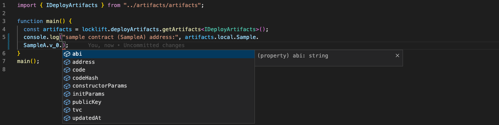

# Deploy artifacts plugin

[Locklift](https://github.com/broxus/locklift) plugin that enables you to store build artifacts across contract migration scripts.


## Installation
1. Install plugin.
```bash
npm i --save-dev locklift-deploy-artifacts
```

2. Initialize the plugin via the `locklift.config.ts` file. 
```ts
// locklift.config.ts
// ...
import { FactorySource } from "./build/factorySource";
import { DeployArtifactsExtension } from "locklift-deploy-artifacts";
import "locklift-deploy-artifacts";

declare module "locklift" {
  export interface Locklift<FactorySource> extends DeployArtifactsExtension<FactorySource> {}
}
// ...
```

## Usage

The deploy artifacts plugin provides several methods to interact with the build artifacts. See `./example` directory to find examples.

Here are the methods and their explanations:

### deployContract()
This method deploys a contract and saves its artifacts to the `./artifacts` directory.

It takes three arguments:
`alias` - the alias of the contract
`version` - the version of the contract, use "latest" to increment version
`args` - the deployment parameters, the same as you use at `locklift.factory.deployContract()`

```ts
const { contract, tx } = await locklift.deployArtifacts.deployContract(alias, version, args);
```


### getArtifacts()
This method returns an object with the current state of the build artifacts:

```ts
import { IDeployArtifacts } from "../artifacts/artifacts";
const artifacts = locklift.deployArtifacts.getArtifacts<IDeployArtifacts>();
console.log("SampleA contract address",artifacts.local.SampleA.v0.address)
```


### reset()
This method deletes all artifacts and resets storage:
```ts
locklift.deployArtifacts.reset();
```


### ./artifacts directory
The directory to store deploy artifacts. Have the following structure:
```bash
./artifacts
├── artifacts.d.ts 
├── journal.json
└── local
```
artifacts.d.ts - stores IDeployArtifacts interface
journal.json - file to store actual values
local - directory to store contracts deployed to the local network


